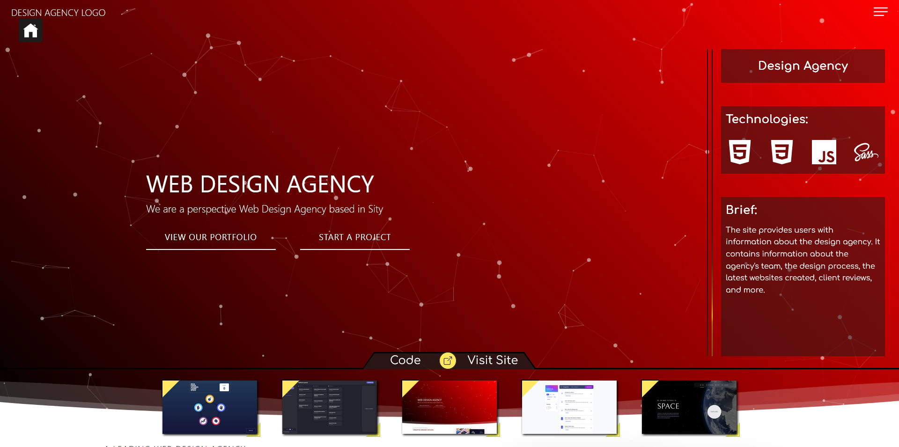

# My Projects Website

This is a website with all my projects.

## Projects Functionality

At the bottom of the site there is a slider that allows the user to navigate through my projects. It allows the user to use keyboard navigation with left and right arrows and navigation with the mouse wheel. The user sees an information about the current slide/website. This information consists of: two preview images as the background of the page, website title, slider with site technologies, brief information about its functionality. On mobile devices, only one image of the site is displayed, but the user can scroll through it like a real page, but without interactivity.

You can visit the website by clicking [this link](https://works.pikulinweb.ru)

## Technologies used:

- HTML
- CSS
- SCSS
- Flexbox
- Adaptive layout
- TypeScript
- JSON
- Vite
- Swiper

## How to start

1. Clone the repository `git clone https://github.com/kanae367/projects-website`
2. Install all dependencies `npm install`
3. Run `npm run dev` command
